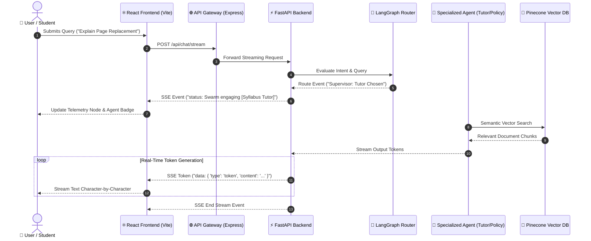

# 🦁 Chimera AI — Multi-Agent Academic Swarm

> **Next-Generation Academic Platform with Real-Time Dynamic Agent Routing, SSE Streaming, Vector Data Ingestion, and Full Telemetry Visualization.**

---

## 🌟 Overview

**Chimera AI** is an intelligent multi-agent academic assistant platform. Powered by **LangGraph**, **FastAPI**, **Pinecone Vector DB**, and **React + Vite**, Chimera dynamically evaluates student and faculty queries in real time. It routes intents through specialized agents (**Syllabus Tutor**, **Policy Agent**, **Exam Strategist**, and **Supervisor Router**) while delivering token-by-token streaming responses over **Server-Sent Events (SSE)**.

---

## 🚀 Key Features & Interactive Routes

### 1. 🏠 Landing Page (`/`)
* **Design & Motion**: Inspired by 21st.dev component designs with timeline animations, ambient radial glow layers, and crisp badge pills.
* **Prompt Router Console**: Interactive query bar allowing users to select or type sample course questions to test agent routing instant preview.
* **Custom Color Palette**: Theme matching `#333D4E` (Primary), `#FFFFFF` (Card/Secondary), `#5B9EE1` (Accent), `#B9D5F7` (Muted), `#E54D4D` (Destructive), `#DCE8F6` (Background).

### 2. 🔐 Authentication & Role Portal (`/login`)
* **Spotlight Card Motion**: Integrated glowing cursor spotlight card components.
* **Role Toggles**: Student and Faculty quick persona switching with local session persistence.
* **Instant Demo Mode**: Access full platform features without complex OAuth friction.

### 3. 💬 Interactive Chat Window (`/chat`)
* **Real-time SSE Token Streaming**: Ultra-fast token-by-token text generation via Server-Sent Events (`EventSource` / `fetch` streaming parser).
* **Dynamic Agent Badges**: Real-time visual badge updates reflecting which active agent (Tutor, Policy Agent, Strategist) handled the response.
* **Vector DB Context Filter**: Toggle vector retrieval filters between **Student Syllabi** and **Teacher Question Banks**.

### 4. 📄 Vector DB Data Ingestion (`/ingest`)
* **Data Ingestion**: Upload course PDF syllabi and TXT question banks directly into Pinecone vector storage.
* **Real-time Feedback**: Live progress indicators, file metadata extraction, and vector index status displays.

### 5. ⚡ Live Telemetry & Data Flow Visualizer (`/telemetry`)
* **Dynamic Swarm Graph**: Visual node flow displaying query progression from Ingress $\rightarrow$ Router $\rightarrow-[#5B9EE1] \rightarrow$ Active Agent $\rightarrow$ Pinecone Vector DB.
* **Live SSE Log Terminal**: Real-time event log console streaming backend events, tool execution timestamps, and cache status.

---

## 📊 System Architecture & Data Flow (Mermaid Diagram)



---

## 🛠️ Frontend Stack & Micro-Interactions

| Library / Tool | Purpose |
| :--- | :--- |
| **React 19 + Vite** | High-performance SPA frontend with HMR and instant builds |
| **Tailwind CSS v4** | Modern styling using custom CSS theme variables |
| **Framer Motion** | Smooth hover micro-interactions, layout spring transitions, and timeline animations |
| **Lucide React** | Scalable icon set for navigation, status, and telemetry nodes |
| **21st.dev UI Elements** | Spotlight cards, motion drawers, and timeline utilities |
| **Server-Sent Events (SSE)** | Real-time token streaming & telemetry event feed |

---

## 🌐 Deployment & Setup Instructions

### 📦 Deploying Frontend on Vercel
This repository includes a preconfigured `vercel.json` for seamless static SPA builds on Vercel:

1. Import repository to **Vercel**.
2. Vercel automatically runs:
   ```bash
   npm install --prefix chimera-frontend
   npm run build --prefix chimera-frontend
   ```
3. Output Directory: `chimera-frontend/dist`

### 💻 Local Development
```bash
# 1. Install & Run Frontend
cd chimera-frontend
npm install
npm run dev

# 2. Run Python Backend (Port 8000)
cd ../chimera_backend
pip install -r requirements.txt
python server.py
```

---

## 📁 Repository Structure

```
chimera/
├── chimera-frontend/          # React + Vite Frontend Application
│   ├── src/
│   │   ├── components/        # Navigation, Header, AgentPlan, Telemetry
│   │   ├── pages/             # HomePage, LoginPage, ChatPage, IngestPage, TelemetryPage
│   │   └── index.css          # Tailwind CSS v4 Theme Variables & Styling
│   └── vercel.json            # Subdirectory Vercel build configuration
├── chimera_backend/           # FastAPI Multi-Agent LangGraph Service
│   ├── server.py              # Main SSE Streaming & Ingestion Endpoints
│   ├── orchestrator.py        # LangGraph Master Swarm Graph
│   ├── document_manager.py    # Vector Embedding & Ingestion Pipelines
│   └── offline_retriever.py   # TF-IDF Fallback Search Engine
├── vercel.json                # Root Vercel Build Routing
└── package.json               # Root Monorepo Scripts
```

---

## 📝 License
Distributed under the **MIT License**.
