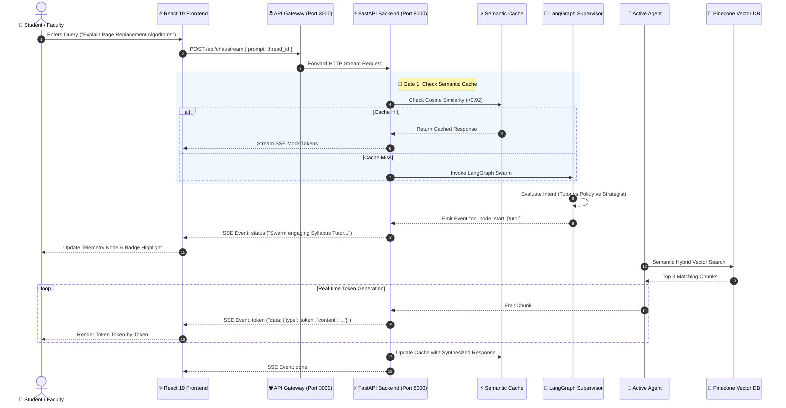
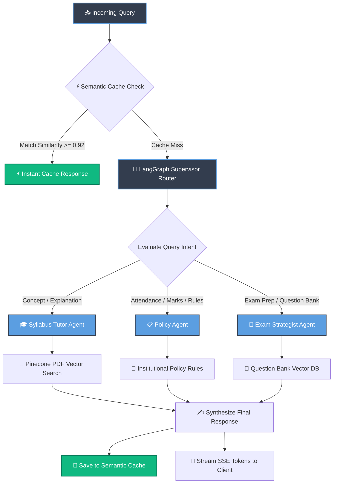
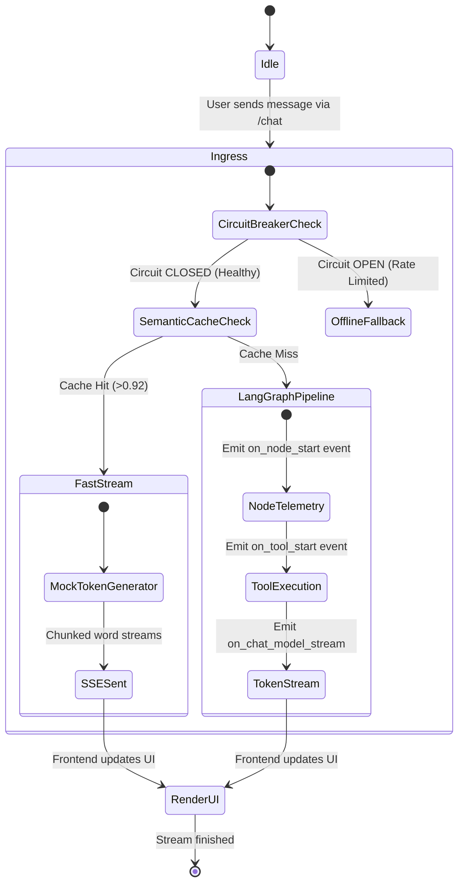

# 🦁 Chimera AI — Multi-Agent Academic Swarm


> **Enterprise-Grade Academic Intelligence Platform featuring Dynamic Multi-Agent Swarm Routing, Real-Time SSE Token Streaming, Vector Data Ingestion, Semantic Caching, Circuit Breaker Fallbacks, and Live Data Flow Telemetry.**

---

## 📋 Table of Contents

- [🌟 Overview](#-overview)
- [🧩 Architecture & Swarm Intelligence](#-architecture--swarm-intelligence)
- [📈 System Diagrams (Mermaid.js)](#-system-diagrams-mermaidjs)
  - [1. End-to-End User Query Sequence](#1-end-to-end-user-query-sequence)
  - [2. LangGraph Supervisor Swarm Decision Tree](#2-langgraph-supervisor-swarm-decision-tree)
  - [3. SSE Token Streaming & Semantic Cache Interception](#3-sse-token-streaming--semantic-cache-interception)
- [🖥️ Frontend Pages & Interactive Routes](#%EF%B8%8F-frontend-pages--interactive-routes)
- [⚡ Real-Time SSE Protocol & Event Traps](#-real-time-sse-protocol--event-traps)
- [📄 Vector Data Ingestion & RAG Pipeline](#-vector-data-ingestion--rag-pipeline)
- [🛡️ Semantic Caching & Circuit Breaker Fault Tolerance](#%EF%B8%8F-semantic-caching--circuit-breaker-fault-tolerance)
- [🔗 API Endpoints Reference](#-api-endpoints-reference)
- [⚙️ Environment Configuration](#%EF%B8%8F-environment-configuration)
- [🚀 Deployment Matrix (Vercel + Cloud Services)](#-deployment-matrix-vercel--cloud-services)
- [📝 License](#-license)

---

## 🌟 Overview

**Chimera AI** is a state-of-the-art multi-agent academic ecosystem designed to assist students and faculty. Unlike monolithic LLM wrappers, Chimera employs a **Supervisor Router** built on **LangGraph** that dynamically evaluates user intent in real time and delegates execution to specialized domain agents:

* 🎓 **Syllabus Tutor Agent**: Explains course concepts, syllabus modules, and academic literature using Pinecone RAG retrieval.
* 📋 **Policy Agent**: Answers formal university policy, grading schemes, attendance requirements, and administrative rules.
* 🧠 **Exam Strategist Agent**: Provides study plans, topic weightage, and question-bank preparation tactics.

---

## 📈 System Diagrams (Mermaid.js)

### 1. End-to-End User Query Sequence



---

### 2. LangGraph Supervisor Swarm Decision Tree



---

### 3. SSE Token Streaming & Semantic Cache Interception



---

## 🖥️ Frontend Pages & Interactive Routes

The frontend is a React 19 single-page application built with **Vite**, **Tailwind CSS v4**, **Framer Motion**, and **21st.dev UI Components**.

| Route | Page Component | Features & Micro-Interactions |
| :--- | :--- | :--- |
| `/` | `Hero.jsx` / `HomePage` | Motion Timeline animations, ambient radial glow layers, interactive prompt router console with sample chips. |
| `/login` | `LoginPage.jsx` | SpotlightCard cursor glow, Student/Faculty persona toggles, local session persistence, instant demo access. |
| `/chat` | `ChatPage.jsx` | Complete chat window with SSE token streaming parser, dynamic agent badges, prompt chips, and vector filters. |
| `/ingest` | `IngestPage.jsx` | Vector DB ingestion portal supporting student PDF syllabi and faculty TXT question bank uploads. |
| `/telemetry` | `TelemetryPage.jsx` | Interactive 4-stage data flow node visualizer (Ingress $\rightarrow$ Router $\rightarrow$ Agent $\rightarrow$ Vector DB) and real-time SSE event log. |

---

## 🎨 Design Palette

To maintain visual cohesion, the application utilizes the following dedicated theme variables defined in `chimera-frontend/src/index.css`:

```css
:root {
  --primary: #333D4E;     /* Dark Slate Primary Accent */
  --secondary: #FFFFFF;   /* Clean Card Background */
  --accent: #5B9EE1;      /* Bright Azure Blue */
  --muted: #B9D5F7;       /* Soft Ice Blue */
  --destructive: #E54D4D; /* Alert Crimson */
  --background: #DCE8F6;  /* Soft Sky Background */
  --card: #FFFFFF;        /* Card Surface */
  --border: #E2E8F0;      /* Divider Border */
}
```

---

## ⚡ Real-Time SSE Protocol & Event Traps

The chat streaming endpoint (`/api/chat/stream`) transmits Server-Sent Events with structured JSON payloads:

### SSE Event Format
```http
HTTP/1.1 200 OK
Content-Type: text/event-stream
Cache-Control: no-cache
Connection: keep-alive

data: {"type": "status", "content": "Swarm actively engaging node: [tutor]..."}

data: {"type": "status", "content": "Connecting to Pinecone Cloud via: [pinecone_retriever]..."}

data: {"type": "token", "content": "Page "}

data: {"type": "token", "content": "Replacement "}

data: {"type": "token", "content": "Algorithms "}
```

### Event Payload Types
* `status`: Emitted when LangGraph transitions between supervisor router nodes or executes retrieval tools. Updates the agent telemetry badge in real time.
* `token`: Emitted during LLM streaming. Appended token-by-token to the active conversation message bubble.

---

## 📄 Vector Data Ingestion & RAG Pipeline

* **PDF Ingestion**: Parses course syllabus PDFs using PyPDF, generates chunk embeddings via HuggingFace models, and upserts them to Pinecone under the `student_documents` namespace.
* **Question Bank Ingestion**: Ingests exam question banks (`.txt`), extracts structured Q&A pairs, and stores them in Pinecone for retrieval by the **Exam Strategist Agent**.
* **TF-IDF Offline Fallback**: If cloud vector search is temporarily offline, an embedded TF-IDF vector index performs local similarity search over uploaded documents.

---

## 🛡️ Semantic Caching & Circuit Breaker Fault Tolerance

1. **Semantic Cache**:
   - Computes cosine similarity between incoming prompt embeddings and cached query vectors.
   - If similarity exceeds `0.92`, the system short-circuits execution and streams cached responses instantly.
2. **Circuit Breaker**:
   - Tracks consecutive API failure counts.
   - Trips to `OPEN` state upon 3 consecutive failures (e.g., API rate limits).
   - Automatically diverts queries to local semantic cache or TF-IDF offline retrievers to guarantee high availability.

---

## 🔗 API Endpoints Reference

### 1. Gateway & Chat Routes

#### `POST /api/chat/stream`
* **Description**: Async Server-Sent Events endpoint streaming real-time tokens and node telemetry events.
* **Payload**:
  ```json
  {
    "prompt": "What are the rules for minimum attendance?",
    "thread_id": "session-1234",
    "document_id": "optional-pdf-uuid"
  }
  ```

#### `POST /api/chat`
* **Description**: Traditional blocking JSON endpoint for query execution.

---

### 2. Ingestion Routes

#### `POST /api/student/document`
* **Description**: Uploads student course syllabus PDF to vector DB.
* **Content-Type**: `multipart/form-data`

#### `POST /api/teacher/question-bank`
* **Description**: Uploads teacher exam question bank TXT file to vector DB.
* **Content-Type**: `multipart/form-data`

---

## ⚙️ Environment Configuration

Create a `.env` file inside `chimera_backend/` (or set environment variables in your deployment platform):

```env
# Groq LLM API Key
GROQ_API_KEY=your_groq_api_key_here
GROQ_MODEL=openai/gpt-oss-20b

# Pinecone Vector Database
PINECONE_API_KEY=your_pinecone_api_key
PINECONE_INDEX_NAME=chimera-academic-index

# Gateway & Server Port Configuration
PORT=3000
BACKEND_PORT=8000
```

---

## 🚀 Deployment Matrix (Vercel + Cloud Services)

```
                       ┌─────────────────────────┐
                       │   Vercel Deployment     │
                       │   (chimera-frontend)    │
                       └────────────┬────────────┘
                                    │
                                    │ HTTPS API Calls / SSE Streams
                                    ▼
                       ┌─────────────────────────┐
                       │   Express API Gateway   │
                       │   (chimera-gateway)     │
                       └────────────┬────────────┘
                                    │
                                    │ Proxy to Python Microservice
                                    ▼
                       ┌─────────────────────────┐
                       │  FastAPI LangGraph Swarm│
                       │   (chimera_backend)     │
                       └─────────────────────────┘
```

### Deploying Frontend on Vercel
The repository includes a root `vercel.json` and root `package.json` preconfigured for static Vite builds:

1. Import your GitHub repository into **Vercel**.
2. Vercel executes:
   * **Install Command**: `npm install --prefix chimera-frontend`
   * **Build Command**: `npm run build --prefix chimera-frontend`
   * **Output Directory**: `chimera-frontend/dist`
3. SPA routing automatically redirects `/*` to `/index.html`.

---

## 📝 License

Distributed under the **MIT License**. See `LICENSE` for details.
