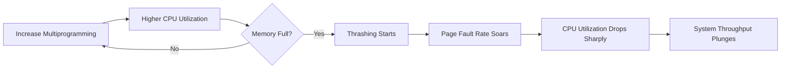

# Compiled Academic Study Guide

# Academic Revision Guide: Memory Management and Deadlock Avoidance

This guide provides a comprehensive analysis of key Operating System concepts, focusing on memory management strategies and deadlock avoidance mechanisms.

---

## 1. Comparison of FIFO and LRU Page Replacement Algorithms

In a virtual memory system, when physical memory is fully occupied and a new page must be brought in, the operating system must select a victim page to evict. Under heavy memory load, the choice of algorithm significantly impacts system performance.

### First-In-First-Out (FIFO)
The FIFO algorithm is the simplest to implement, utilizing a queue-based approach where the oldest page in memory is the first to be replaced.
*   **Advantages:** It is "easy to program" and requires minimal overhead (Context, 298).
*   **Disadvantages:** It suffers from **Belady’s Anomaly**, a phenomenon where increasing the number of page frames can actually result in an *increase* in the number of page faults (Context, 298). It does not account for how often or how recently a page is used.

### Least Recently Used (LRU)
LRU is a more sophisticated approach that uses the recent past as an approximation of the future. It replaces the page that has not been used for the longest period of time.
*   **Performance:** LRU is generally considered "much better than FIFO" (Context, 298). For example, in specific reference strings, LRU may produce 12 faults where FIFO produces 15.
*   **Implementation:** The major drawback is that it "may require substantial hardware assistance" to track the time of last use for every page, making it more complex to implement than FIFO (Context, 298).

### Comparison Summary
| Feature | FIFO | LRU |
| :--- | :--- | :--- |
| **Logic** | Replaces the oldest page. | Replaces the page unused for the longest time. |
| **Performance** | Poor; prone to Belady's Anomaly. | Good; approximation of optimal replacement. |
| **Complexity** | Low (Simple Queue). | High (Requires hardware/stack support). |
| **Heavy Load** | High page fault rates. | More stable, respects temporal locality. |

---

## 2. Thrashing and CPU Utilization

**Thrashing** is a state of extreme performance degradation that occurs when a system spends more time paging than executing instructions.

### The Mechanism of Thrashing
Thrashing occurs when the total size of the "working sets" (the pages currently in active use) of all processes exceeds the available physical memory. 
1.  The page-fault rate "increases tremendously" (Context, 298).
2.  Processes wait for the paging device to swap pages in and out.
3.  CPU utilization drops because most processes are blocked waiting for I/O.
4.  The OS, seeing low CPU utilization, may mistakenly increase the **degree of multiprogramming** by starting new processes, which exacerbates the problem.

### Impact on CPU Utilization
The relationship between CPU utilization and the degree of multiprogramming is non-linear. As shown in the workflow below, utilization increases until a saturation point is reached, after which thrashing causes a "sharp drop" (Context, 298).

**Solution:** To stop thrashing and recover CPU utilization, the system must **decrease the degree of multiprogramming** by terminating or suspending processes (Context, 298).

---

## 3. The Banker’s Algorithm and Resource Allocation

The **Banker’s Algorithm** is a deadlock-avoidance strategy designed for systems with multiple instances of each resource type.

### Why Use Banker's Algorithm?
While a **Resource-Allocation Graph (RAG)** is effective for identifying deadlocks in systems where each resource has only one instance, it is "not applicable" to systems with multiple instances (Context, 298). The Banker's Algorithm is less efficient than a RAG but is necessary for complex resource environments.

### Core Principles
*   **Maximum Claim:** Every process must declare the maximum number of resource instances it may ever need upon entering the system (Context, 298).
*   **Safe State:** The system only grants a resource request if it can determine that there is a sequence of process executions that allows all processes to complete their maximum needs.
*   **Banking Analogy:** The name stems from a bank ensuring it never allocates cash in a way that it cannot satisfy the needs of all its customers (Context, 298).

### Resource Allocation Graph (RAG) Representation
In a RAG, circles represent processes and rectangles represent resource types. Dots inside the rectangles represent instances.

*Note: In the Banker's Algorithm, the system uses data structures (Available, Max, Allocation, Need) rather than just the graph to calculate if a state is "Safe" before fulfilling a request.*

## Accompanying Diagram

